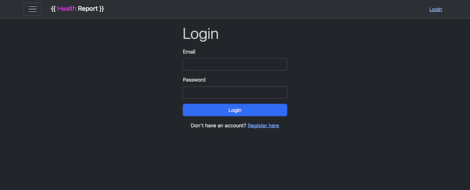
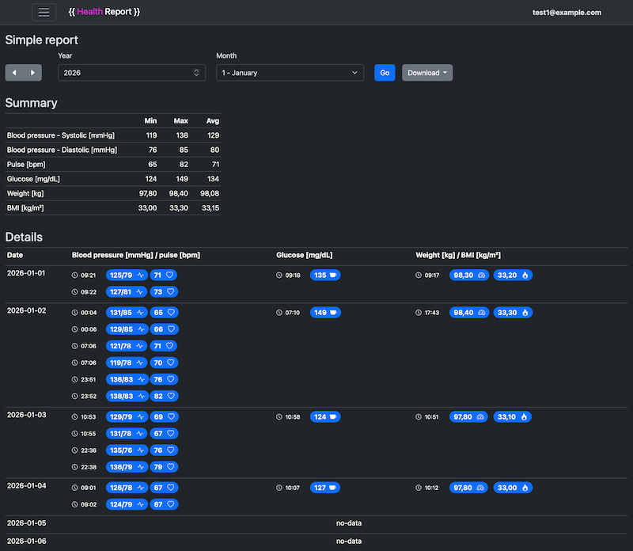
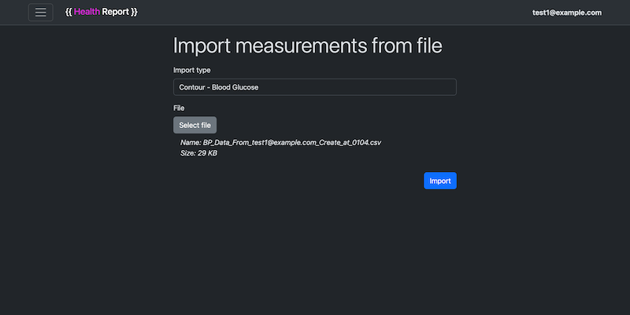

# HealthReport

Short description
-----------------
HealthReport is a simple .NET 10 solution for collecting, importing and reporting health measurements (blood pressure, glucose, weight, etc.).

Architecture
------------
- `HealthReport.Domain` — domain entities and business logic.
- `HealthReport.Application` — application services, parsers and use-cases.
- `HealthReport.Infrastructure` — EF Core mappings and data access implementations.
- `HealthReport.Web` — Blazor Server UI and minimal API endpoints.

Technologies
------------
- .NET 10
- Blazor Server

Build & run
-----------
General build:
```bash
dotnet restore
dotnet build HealthReport.sln
```

Run the web app (development):
```bash
dotnet run --project src/HealthReport.Web/HealthReport.Web.csproj
```

Screenshots
----------

[](docs/screenshots/login.png)

[](docs/screenshots/base-report.png)

[](docs/screenshots/import-measurements.png)


DEMO Runner: iHealth CSV importer
---------------------------
There is a small runner that demonstrates importing CSV files exported from iHealth.

Run the runner:
```bash
dotnet run --project src/HealthReport.Runners.IHealth.BloodPressureCsvImporter -- "/path/to/BP_Data.csv"
```
The runner expects the CSV file path as the first argument and assumes the file contains a header row by default.

DEMO Runner: Contour (blood glucose) CSV importer
---------------------------
A runner demonstrating import of Contour meter CSV exports into `BloodGlucoseMeasurement`.

Run the Contour runner:
```bash
dotnet run --project src/HealthReport.Runners.Contour.BloodGlucoseCsvImporter -- "/path/to/Contour.csv"
```

Notes:
- File path: first argument to the runner.
- Expected datetime format in CSV: `dd.MM.yyyy HH:mm:ss` (e.g. `20.09.2025 06:54:49`).
- Meal markers (Polish) are mapped: `Na czczo` → Fasting, `Przed posiłkiem` → BeforeMeal, `Po posiłku` → AfterMeal.
- The runner prints imported record count and parse errors, and shows the first 10 records.

DEMO Runner: Garmin (weight) CSV importer
---------------------------
Runner for importing weight measurements exported from Garmin Connect into `WeightMeasurement`.

Run the Garmin runner:
```bash
dotnet run --project src/HealthReport.Runners.Garmin.WeightCsvImporter -- "/path/to/Weight.csv"
```

Notes about Garmin CSV format used in examples:
- The export sometimes places the date on a separate line (e.g. `" 2025 Gru 28",`) and then one or more rows with time and measurements (e.g. `10:20 AM,98.8 kg,...`). The parser handles this pattern by remembering the last seen date and applying it to subsequent time rows.
- Time may be in 12h format with `AM/PM` or 24h format. Dates may use Polish month abbreviations (e.g. `Gru` = grudzień).
- Numeric fields may include units/suffixes (`kg`, `%`) — the importer strips those when parsing.
- The runner prints imported record count, parse errors (with line numbers), and shows the first 10 parsed records.


